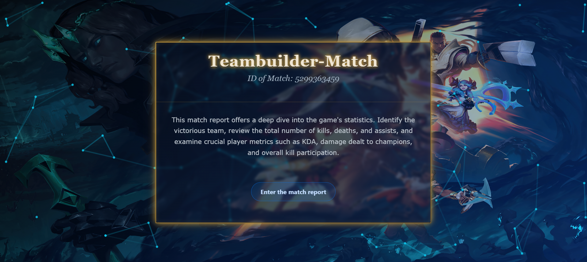
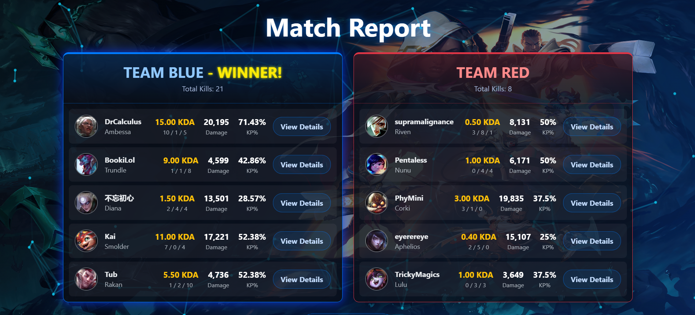
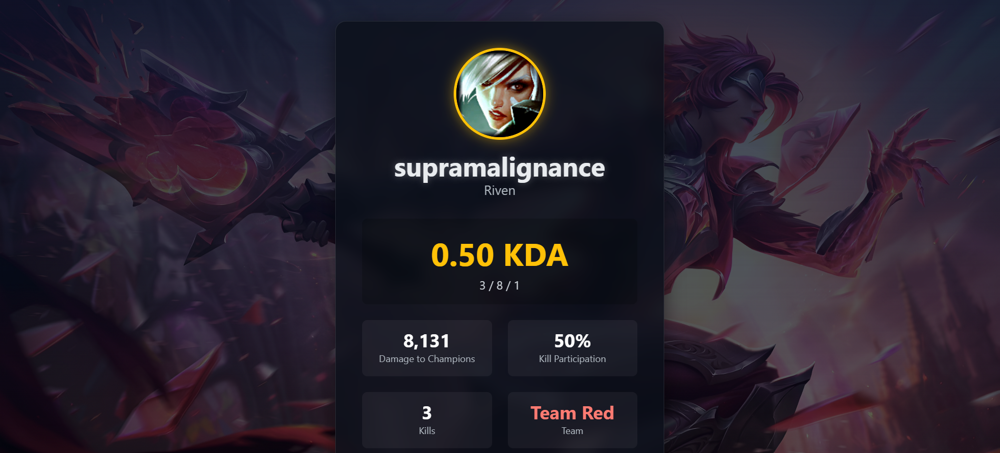

# LoL Insights

## Task Overview

**LoL Insights** is a web application that lets you view and compare League of Legends match statistics in a simple, visual way.  
You can see stats for each team, find out who won, and click on any player to see their detailed performance.

---

## Preview





---

## Technologies Used

- **Node.js** – JavaScript runtime for the backend server
- **Express** – Web framework for building the backend API
- **MongoDB** – Database for storing match and player data
- **Socket.io** – Real-time communication between backend and frontend
- **React** – JavaScript library for building the user interface
- **Vite** – Fast development server and build tool for React
- **Bootstrap** – For responsive and modern UI styling
- **Animations** – Visual effects and particles for a dynamic user experience

---

## Folder Structure

```
Lol task/
│
├── backend/         # Backend (the part that provides the data)
│
├── frontend/        # Frontend (the part you see in your browser)
│
└── screenshots/         # Images for README preview
```

---

## Prerequisites

- [Node.js](https://nodejs.org/) (a program that lets you run JavaScript on your computer)
- [npm](https://www.npmjs.com/) (comes with Node.js, helps you install needed files)

---

## How to Set Up and Run

### 1. Install the Needed Files

You only need to do this once for each part.

#### For the Backend

1. Open a terminal (Command Prompt or PowerShell).
2. Go to the backend folder:
   ```sh
   cd "Lol task\backend"
   ```
3. Install the needed files:
   ```sh
   npm install
   ```

#### For the Frontend

1. Open a new terminal window.
2. Go to the frontend folder:
   ```sh
   cd "Lol task\frontend"
   ```
3. Install the needed files:
   ```sh
   npm install
   ```

---

### 2. Start the Application

#### Start the Backend

1. In the terminal for the backend, run:
   ```sh
   npm start
   ```
2. Leave this terminal open.

#### Start the Frontend

1. In the terminal for the frontend, run:
   ```sh
   npm run dev
   ```
2. After a few seconds, the terminal will show a link like `http://localhost:5173/` (or a similar number).

---

### 3. Open the App in Your Browser

- Open Google Chrome, Edge, or any browser.
- Type the link shown in the frontend terminal (for example: `http://localhost:5173/`) and press Enter.
- You should now see the LoL Insights app!

---

## What You Can Do

- See stats for each team and player.
- The winning team is highlighted.
- Click the "View" button next to any player to see their detailed stats.

---

## Troubleshooting

- If you see errors about missing files, repeat the `npm install` steps above.
- If the app does not open, check that both backend and frontend terminals are running and that you are using the correct link.
- If you need help, ask chatgbt to help you run the commands above.
